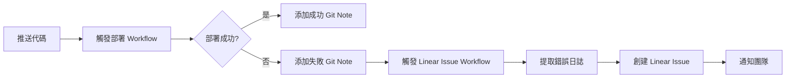

# 自動創建 Linear Issue - 部署失敗通知

## 功能說明

當 GitHub Actions 的 Firebase 部署 workflow 失敗時,系統會自動在 Linear 中創建一個 issue,包含:

- 🚨 失敗的 workflow 資訊
- 📋 錯誤摘要和失敗的步驟
- 🔗 相關連結(workflow 運行、commit)
- 📝 建議的修復步驟
- 🏷️ 自動標記為 "Bug" 並設置為高優先級

## 設置步驟

### 1. 獲取 Linear API Key

1. 登入 [Linear](https://linear.app)
2. 進入 Settings → API
3. 點擊 "Create new API key"
4. 複製生成的 API key

### 2. 添加 GitHub Secret

1. 進入 GitHub 倉庫
2. 點擊 Settings → Secrets and variables → Actions
3. 點擊 "New repository secret"
4. 名稱: `LINEAR_API_KEY`
5. 值: 貼上你的 Linear API key
6. 點擊 "Add secret"

### 3. 驗證 Workflow 文件

確保以下文件存在:
- `.github/workflows/firebase-deploy.yml` - 主要的部署 workflow
- `.github/workflows/create-linear-issue-on-failure.yml` - 失敗時創建 issue 的 workflow

## 工作流程



## Issue 內容範例

創建的 Linear issue 會包含以下資訊:

### 標題
```
🚨 部署失敗: dev - abc1234
```

### 描述
```markdown
## 🚨 部署失敗通知

**Workflow:** Firebase Hosting Deploy
**分支:** `dev`
**Commit:** `abc1234567`
**作者:** shiaoal-new
**Commit 訊息:** feat: 添加新功能

---

## 📋 錯誤摘要

### ❌ Job: build-and-deploy

- **步驟:** Build & Export
  **狀態:** failure
- **步驟:** Firebase Deploy
  **狀態:** failure

---

## 🔗 相關連結

- [查看 Workflow 運行](https://github.com/...)
- [查看 Commit](https://github.com/...)

---

## 📝 建議操作

1. 查看上方的錯誤摘要
2. 點擊 Workflow 連結查看完整日誌
3. 檢查相關的代碼變更
4. 在本地重現並修復問題
5. 重新部署測試

---

*此 issue 由 GitHub Actions 自動創建*
```

### 屬性
- **Team:** Tongxing-website
- **Status:** Todo
- **Priority:** Urgent (1)
- **Labels:** Bug

## 自定義配置

### 修改 Issue 屬性

編輯 `.github/workflows/create-linear-issue-on-failure.yml`:

```yaml
# 修改優先級 (0=無, 1=緊急, 2=高, 3=中, 4=低)
"priority": 1

# 修改狀態
"stateId": "fdf009d4-2ad2-4765-97ba-0a81b09e7825"  # Todo

# 修改標籤
"labelIds": ["fca6f13a-3b0d-41cc-9ffe-76ab03f4fab0"]  # Bug
```

### 可用的狀態 ID

| 狀態 | ID |
|------|-----|
| Backlog | `2631f458-1568-4b84-8fe3-87a6200ea005` |
| Todo | `fdf009d4-2ad2-4765-97ba-0a81b09e7825` |
| In Progress | `ec83e336-1715-49ee-bdb4-a69a3ee7f657` |
| In Review | `8a741c49-ef13-4f66-88f7-a1863ef8e2be` |
| Done | `9f68ffe8-1cb9-45b9-96b4-760faa2b8d34` |
| Canceled | `819d91e3-ed9f-42e1-965c-3dd4d9857da4` |
| Duplicate | `e7d44853-c678-4e3d-afb4-8b3597331fc9` |

### 可用的標籤 ID

| 標籤 | ID | 顏色 |
|------|-----|------|
| Bug | `fca6f13a-3b0d-41cc-9ffe-76ab03f4fab0` | 🔴 紅色 |
| Feature | `615b6454-455a-4b11-ab7c-32550745bacc` | 🟣 紫色 |
| Improvement | `13eff44e-3b36-4ba0-b7da-3a24bc4042c7` | 🔵 藍色 |

### 添加自動分配

如果想自動分配給特定人員,添加:

```yaml
"assigneeId": "YOUR_USER_ID"
```

獲取 User ID:
```bash
# 使用 Linear MCP 工具
mcp_linear-mcp-server_list_users
```

## 測試

### 手動觸發測試

1. 故意讓部署失敗(例如:在代碼中添加語法錯誤)
2. 推送到 dev 分支
3. 等待部署失敗
4. 檢查 Linear 是否自動創建了 issue

### 查看 Workflow 日誌

1. 進入 GitHub Actions 頁面
2. 找到 "Create Linear Issue on Failure" workflow
3. 查看執行日誌
4. 確認 issue 創建成功

## 故障排除

### Issue 沒有創建

**檢查項目:**
1. LINEAR_API_KEY secret 是否正確設置
2. Workflow 是否有執行權限
3. Linear API key 是否有效
4. Team ID 是否正確

**查看日誌:**
```bash
# 在 GitHub Actions 頁面查看詳細日誌
```

### API 錯誤

常見錯誤和解決方案:

| 錯誤 | 原因 | 解決方案 |
|------|------|----------|
| `Unauthorized` | API key 無效 | 重新生成並更新 secret |
| `Team not found` | Team ID 錯誤 | 確認 Team ID |
| `Invalid state` | State ID 錯誤 | 使用正確的 state ID |
| `Invalid label` | Label ID 錯誤 | 使用正確的 label ID |

### 提取錯誤日誌失敗

如果無法提取詳細的錯誤日誌:
- Workflow 會使用預設訊息
- 仍然會創建 issue
- 可以手動點擊連結查看完整日誌

## 進階功能

### 添加 Slack 通知

在創建 Linear issue 後,可以添加 Slack 通知:

```yaml
- name: Notify Slack
  if: steps.create-issue.outcome == 'success'
  uses: slackapi/slack-github-action@v1
  with:
    payload: |
      {
        "text": "🚨 部署失敗,已創建 Linear issue: ${{ steps.create-issue.outputs.url }}"
      }
  env:
    SLACK_WEBHOOK_URL: ${{ secrets.SLACK_WEBHOOK_URL }}
```

### 添加郵件通知

```yaml
- name: Send Email
  uses: dawidd6/action-send-mail@v3
  with:
    server_address: smtp.gmail.com
    server_port: 465
    username: ${{ secrets.EMAIL_USERNAME }}
    password: ${{ secrets.EMAIL_PASSWORD }}
    subject: 🚨 部署失敗通知
    body: Linear issue 已創建: ${{ steps.create-issue.outputs.url }}
    to: team@example.com
```

### 自動關閉 Issue

當修復的 commit 成功部署後,可以自動關閉相關的 issue:

```yaml
# 在 firebase-deploy.yml 的成功步驟中添加
- name: Close Related Linear Issues
  if: success()
  run: |
    # 查找相關的 open issues
    # 自動關閉它們
```

## 最佳實踐

1. **定期檢查 Linear issues**
   - 設置每日提醒
   - 優先處理部署失敗的 issues

2. **保持 API key 安全**
   - 不要在代碼中硬編碼
   - 定期輪換 API key

3. **自定義 issue 模板**
   - 根據團隊需求調整描述格式
   - 添加團隊特定的檢查清單

4. **監控 workflow 執行**
   - 確保 workflow 正常運行
   - 查看執行歷史

## 相關文檔

- [Linear API 文檔](https://developers.linear.app/docs/graphql/working-with-the-graphql-api)
- [GitHub Actions 文檔](https://docs.github.com/en/actions)
- [Git Notes 部署記錄](./git-notes-setup.md)

## 總結

✅ **自動化的好處:**
- 🚀 快速響應部署失敗
- 📋 自動記錄錯誤資訊
- 👥 通知團隊成員
- 📊 追蹤部署質量
- ⏱️ 節省手動創建 issue 的時間

現在,每次部署失敗時,你都會在 Linear 中自動獲得一個詳細的 issue,幫助你快速定位和修復問題! 🎉
